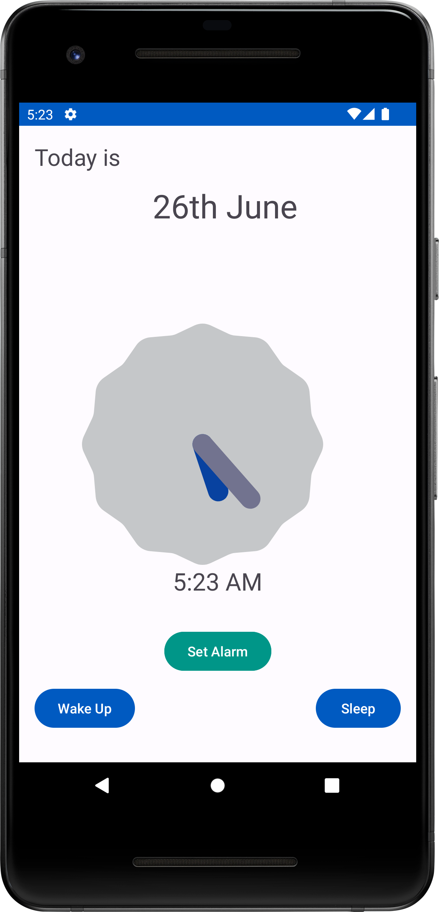
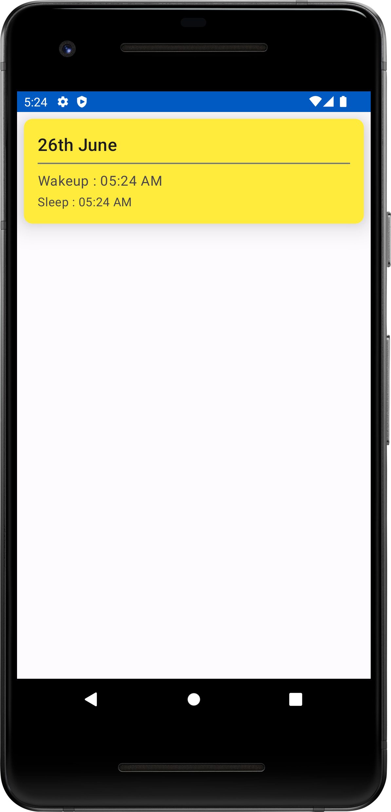

# Sleep Tracker App

Build with Java and Sqlite database

**Features**
1. User can track everday wake up time
2. User can tracke everyday sleep time
3. set alarm for desired wakeup time

* No necessity for internet connection
* Database get cleared after app uninstallation

 

**Warning!!**
> The most important thing when using the app for the first time,it most likely user won't know how to open the Sleep record because there is no button for that. Actually, clicking on the analog clock does the job.

 

**Screenshots**    

 

### <i>No extra configuration required to run the app</i>
Just clone and press run, that all it takes.